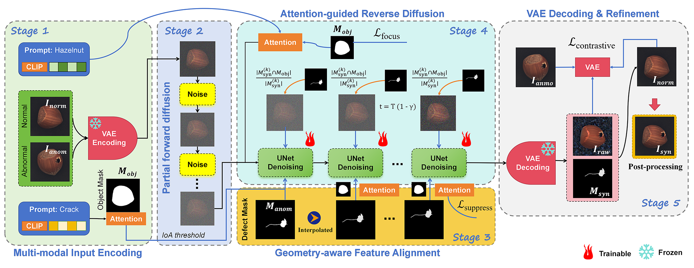

**English** | [中文](README_CN.md)

# 2-GAO: Spatial-Semantic Consistent Industrial Defect Synthesis via Training-Free Latent Optimization

Tianwei Mu, Guangzhou Institute of Industrial Intelligence

## 📋 System Overview

This system is a contrastive learning defect generation tool based on Stable Diffusion. It generates defects on defect-free images guided by defective samples, leveraging attention mechanism optimization and feature alignment.

**Results:**
- [Google Drive](https://drive.google.com/file/d/1FEvOEMTT9A-Ykt7jTK17nSAblMLfGHZa/view)
- [/outputsResults](https://github.com/mutianwei521/2GAO/tree/main/outputsResults)

**Link to original image data (just place it in the corresponding folder)**
- MVTec-AD dataset: [Google Drive](https://drive.google.com/file/d/1BZzy7apJ91cr33-_KG01_Qh-jAeN_zVg/view?usp=drive_link)
- VISA dataset: [Google Drive](https://drive.google.com/file/d/1jaKbzgfHThh7AGqfYQvdphyZfxERbHmq/view?usp=drive_link)
- Concrete crack dataset: [Google Drive](https://drive.google.com/file/d/1ysoPO7OU6GQm2tVTrXvRP0BKX236Aype/view?usp=drive_link)

**Paper**
- Waiting for publishing

### 🏗️ Network Architecture

*Figure: The overall framework consists of five stages: (1) VAE Encoding, (2) IoA Alignment, (3) Forward Diffusion, (4) Attention-Guided Reverse Optimization, and (5) Decoding.*

---
### 📊 Result Show

*Figure: Comprehensive comparison of original, reference, and synthetically defect images of 4 industrial object categories using 2-GAO: (a) bottle, (b) cable, (c) capsule, and (d) carpet.*

---
## 🔧 System Requirements

### Hardware
- **GPU**: NVIDIA GPU (8GB+ VRAM recommended)
- **RAM**: 16GB+
- **Storage**: 10GB+ free space

### Software
- **OS**: Windows 10/11, Linux, macOS
- **Python**: 3.8–3.11 (recommended 3.10)
- **CUDA**: 11.8+ (for GPU acceleration)

---

## 📦 Installation

### 1. Clone Repository
```bash
git clone https://github.com/mutianwei521/2GAO.git
cd 2GAO
```

### 2. Create Virtual Environment
```bash
python -m venv venv
# Windows:
venv\Scripts\activate
# Linux/macOS:
source venv/bin/activate
```

### 3. Install Dependencies
```bash
# Windows (recommended):
pip install -r requirements_windows.txt

# Linux/macOS:
pip install -r requirements.txt
```

### 4. Verify Installation
```bash
python -c "import torch; print('PyTorch:', torch.__version__)"
python -c "import diffusers; print('Diffusers:', diffusers.__version__)"
```

---

## 📁 Project Structure

```
2GAO/
├── main_contrastive.py              # Main entry
├── contrastive_defect_generator.py  # Core generator
├── smart_prompt_generator.py        # Smart prompt generator
├── attention_heatmap_extractor.py   # Attention extractor
├── run_ablation.py                  # Ablation study runner
├── requirements.txt                 # Linux dependencies
├── requirements_windows.txt         # Windows dependencies
├── batch_generate_mvtec.py          # MVTec dataset batch
├── batch_generate_visa.py           # VISA dataset batch
├── batch_generate_concrete.py       # Concrete dataset batch
├── batch_generate_custom.py         # Custom dataset batch
├── test/
│   ├── quick_test_mvtec.py          # MVTec quick test
│   ├── quick_test_visa.py           # VISA quick test
│   ├── quick_test_concrete.py       # Concrete quick test
│   ├── evaluate_visa_metrics.py     # VISA evaluation
│   ├── evaluate_concrete_metrics.py # Concrete evaluation
│   └── evaluate_mvtec_metrics.py    # MVTec evaluation
├── visaImages/                      # VISA dataset images
├── concreteImages/                  # Concrete dataset images
├── mvtecImages/                     # MVTec dataset images
├── outputs_visa/                    # VISA output directory
├── outputs_concrete/                # Concrete output directory
└── outputs_mvtec/                   # MVTec output directory
```

---

## 🚀 Main Programs

### main_contrastive.py
Main entry point for single image defect generation.

```bash
python main_contrastive.py \
    --prompt "bottle crack" \
    --good-dir "images/good" \
    --bad-dir "images/bad" \
    --output-dir "outputs" \
    --num-inference-steps 100 \
    --r 0.25 \
    --enable-feature-alignment \
    --save-attention-heatmaps
```

### contrastive_defect_generator.py
Core generator module (imported by main_contrastive.py).

### attention_heatmap_extractor.py
Extracts and visualizes attention heatmaps.

### smart_prompt_generator.py
Generates optimized prompts based on image content.

---

## 🔬 Quick Test Programs

### test/quick_test_mvtec.py
MVTec dataset quick test.
```bash
python test/quick_test_mvtec.py --category bottle --num-defects 2
```
Parameters:
- `--category`: MVTec category (bottle, cable, capsule, etc.)
- `--num-defects`: Number of defects (1-4)

### test/quick_test_visa.py
VISA dataset quick test.
```bash
python test/quick_test_visa.py --category candle --num-defects 2
```
Parameters:
- `--category`: VISA category (candle, capsules, cashew, etc.)
- `--num-defects`: Number of defects (1-4)

### test/quick_test_concrete.py
Concrete crack dataset quick test.
```bash
python test/quick_test_concrete.py --category CFD --num-defects 2
```
Parameters:
- `--category`: Concrete category (CFD, CRACK500, DeepCrack, etc.)
- `--num-defects`: Number of defects (1-4)

---

## 📦 Batch Generation Programs

### batch_generate_mvtec.py
MVTec dataset batch generation (15 categories).
```bash
python batch_generate_mvtec.py \
    --mvtec-dir "mvtecImages" \
    --output-dir "outputs_mvtec" \
    --num-samples 50 \
    --num-defects 1 2 3 4
```
MVTec Categories: bottle, cable, capsule, carpet, grid, hazelnut, leather, metal_nut, pill, screw, tile, toothbrush, transistor, wood, zipper

### batch_generate_visa.py
VISA dataset batch generation (12 categories).
```bash
python batch_generate_visa.py \
    --visa-dir "visaImages" \
    --output-dir "outputs_visa" \
    --num-samples 50 \
    --num-defects 1 2 3 4
```
VISA Categories: candle, capsules, cashew, chewinggum, fryum, macaroni1, macaroni2, pcb1, pcb2, pcb3, pcb4, pipe_fryum

### batch_generate_concrete.py
Concrete crack dataset batch generation (8 categories).
```bash
python batch_generate_concrete.py \
    --concrete-dir "concreteImages" \
    --output-dir "outputs_concrete" \
    --num-samples 50 \
    --num-defects 1 2 3 4
```
Concrete Categories: CFD, CRACK500, DeepCrack, Eugen, Rissbilder, Volker, crack, cracktree200

### batch_generate_custom.py
Custom dataset batch generation. See [CUSTOM_DATASET.md](CUSTOM_DATASET.md) for details.
```bash
python batch_generate_custom.py \
    --config "config/custom_dataset.yaml" \
    --output-dir "outputs_custom"
```

---

## 📊 Evaluation Programs

### test/evaluate_visa_metrics.py
Evaluate VISA dataset generation results.
```bash
python test/evaluate_visa_metrics.py \
    --output-dir "outputs_visa" \
    --save-csv
```
Metrics: I-AUC, I-F1, P-AUC, P-F1, PRO, IS, LPIPS  
Output Structure: `outputs_visa/{category}/defect_{N}/`

### test/evaluate_concrete_metrics.py
Evaluate Concrete dataset generation results.
```bash
python test/evaluate_concrete_metrics.py \
    --output-dir "outputs_concrete" \
    --save-csv
```
Output Structure: `outputs_concrete/defect_{N}/{category}/`

### test/evaluate_mvtec_metrics.py
Evaluate MVTec dataset generation results.
```bash
python test/evaluate_mvtec_metrics.py \
    --output-dir "outputs_mvtec" \
    --save-csv
```
Output Tables:
- Table A1: Category IS/LPIPS
- Table A2: Scenario metrics (I-AUC, I-F1, P-AUC, P-F1, PRO)
- Table A3: Detailed per-category per-defect metrics

Output Structure: `outputs_mvtec/{category}/{1,2,3,4}/`

---

## 🔬 Ablation Study (Paper Reproducibility)

### run_ablation.py
Reproduce ablation study experiments from Section 2.4 and Appendix. 
Generates attention maps and figures using DAAM attention extraction.

```bash
# Run all ablation experiments (generates Figures 6-12)
python run_ablation.py --mode all

# Semantic Ambiguity Verification (Figure 7)
# Compares generic vs specific prompts attention distribution
python run_ablation.py --mode semantic

# Attention Guidance Verification (Figure 8)
# Compares with/without Focus Loss & Suppression Loss
python run_ablation.py --mode attention

# Latent Entanglement Verification (Figures 9-11)
# Multi-defect attention disentanglement (2/3/4 defects)
python run_ablation.py --mode entanglement

# IoA Alignment Verification (Figure 12)
# Geometric validity: partial/no overlap correction
python run_ablation.py --mode ioa

# Hyperparameter Sensitivity (Figure 6)
# IoA threshold, diffusion steps, optimization steps
python run_ablation.py --mode hyperparameter

# Print Tables S2-S6 only
python run_ablation.py --mode tables
```

**Generated Figures:**
- Figure 6: Hyperparameter sensitivity analysis (4 subplots)
- Figure 7: Semantic ambiguity - generic vs specific prompts
- Figure 8: Attention guidance - Focus/Suppression Loss effect
- Figures 9-11: Latent entanglement - multi-defect disentanglement
- Figure 12: IoA alignment - geometric validity

**Ablation Components (Table S2):**
- **w/o Prompt Guidance**: Semantic consistency (I-AUC: 75.63%)
- **w/o Attention Guidance**: Spatial precision (PRO: 75.64%)
- **w/o Contrastive Loss**: Multi-defect disentanglement (PRO: 78.95%)
- **w/o IoA Alignment**: Geometric validity (PRO: 82.34%)
- **Full Model**: All components (I-AUC: 100%, PRO: 99.90%)

---

## 📁 Output Files

| Directory | Content | Description |
|-----------|---------|-------------|
| `feathered_blend/` | `*.png` | Final blended images (main output) |
| `non_feathered_blend/` | `*.png` | Non-feathered blended images |
| `comparison_grid/` | `*.png` | Before/after comparison |
| `combined_defect_masks/` | `*.png` | Generated defect masks |
| `defect_heatmaps/` | `*.png` | Defect probability heatmaps |
| `original_good/` | `*.png` | Source good images |
| `reference_bad/` | `*.png` | Source defect images |

---

## 📚 Documentation

- [PARAMETERS.md](PARAMETERS.md) - Parameter reference guide
- [CUSTOM_DATASET.md](CUSTOM_DATASET.md) - Custom dataset tutorial

---

## 💡 Examples

### Full VISA Workflow
```bash
# Generate
python batch_generate_visa.py \
    --visa-dir "visaImages" \
    --output-dir "outputs_visa" \
    --num-samples 50

# Evaluate
python test/evaluate_visa_metrics.py \
    --output-dir "outputs_visa" \
    --save-csv
```

### Full MVTec Workflow
```bash
# Generate
python batch_generate_mvtec.py \
    --mvtec-dir "mvtecImages" \
    --output-dir "outputs_mvtec" \
    --num-samples 50

# Evaluate
python test/evaluate_mvtec_metrics.py \
    --output-dir "outputs_mvtec" \
    --save-csv
```

---

## 🎯 Best Practices

1. **Data Preparation**: Ensure accurate mask labeling
2. **Start Simple**: Use defaults first, then fine-tune
3. **Quality Check**: Use `--save-attention-heatmaps`
4. **Hardware Balance**: Adjust steps based on GPU
5. **Evaluate Results**: Use evaluation scripts for metrics

---

## 📜 Acknowledgment

The authors express deep gratitude to Dr. Enyang Gao, General Manager of Deep-Sea 3D Vision Co., Ltd., whose invaluable guidance and mentorship made this research possible. The name “2-GAO” serves as a tribute to Dr. Gao’s contributions to the field of computer vision and his continued support of our research endeavors.


Figure: Dr.Gao's portrait.

---

## 📜 License

MIT License
